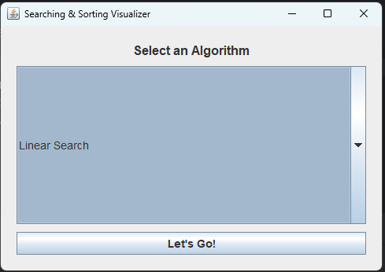
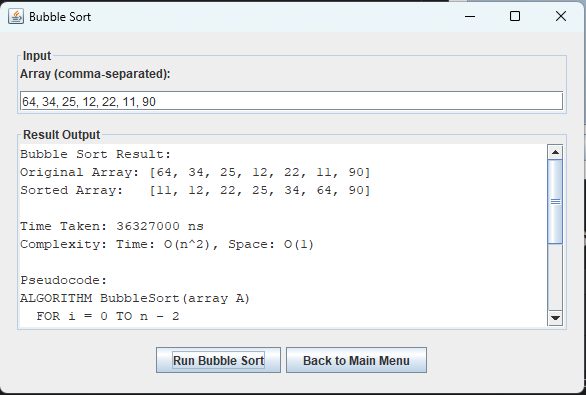

#  Searching & Sorting Algorithms (Java GUI)

This project demonstrates various **searching and sorting algorithms** using a **Java Swing GUI**. It was developed as part of the DCIT 204: Data Structures and Algorithms course.

## 🚀 Features

- 🔎 **Searching Algorithms:**
    - Linear Search
    - Binary Search

- 📊 **Sorting Algorithms:**
    - Bubble Sort
    - Selection Sort
    - Insertion Sort
    - Merge Sort
    - Quick Sort
    - Heap Sort

- 🖥️ **GUI Interface** (Java Swing):
    - Easy algorithm selection via menu
    - User-friendly input prompts
    - Clear, step-by-step output of sorted/search results
    - Time and space complexity displayed after execution

- ✅ Exception handling for invalid inputs
- 📂 Modular file structure for easy maintenance

## 🛠️ Technologies

- Java (JDK 17+)
- Java Swing (for GUI)
- IntelliJ IDEA (recommended IDE)

## 📸 Screenshots




## 📁 Project Structure

```text
src/
├── dsa/
│   ├── algorithms/     # Sorting and Searching logic
│   ├── ui/             # GUI components for each algorithm
│   ├── utils/          # Utility classes like complexity display
│   └── runner/         # Main logic and flow control


